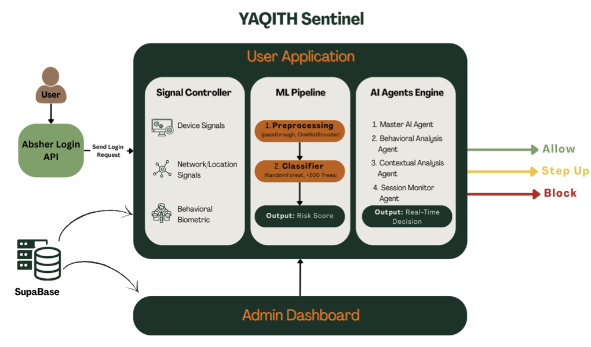
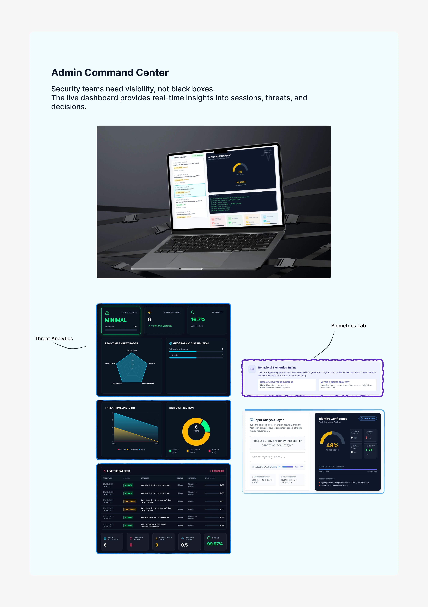
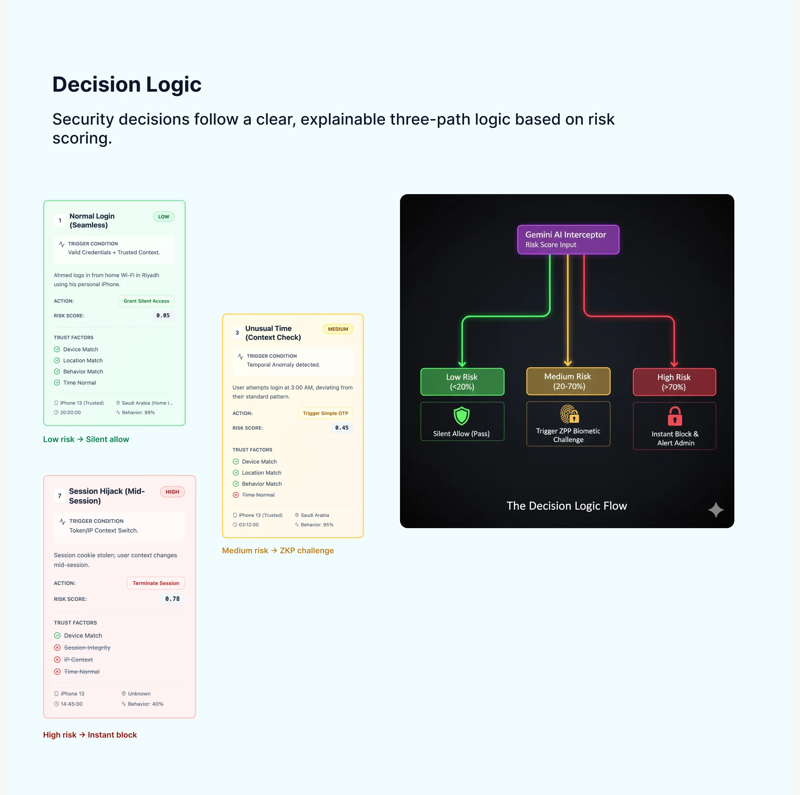
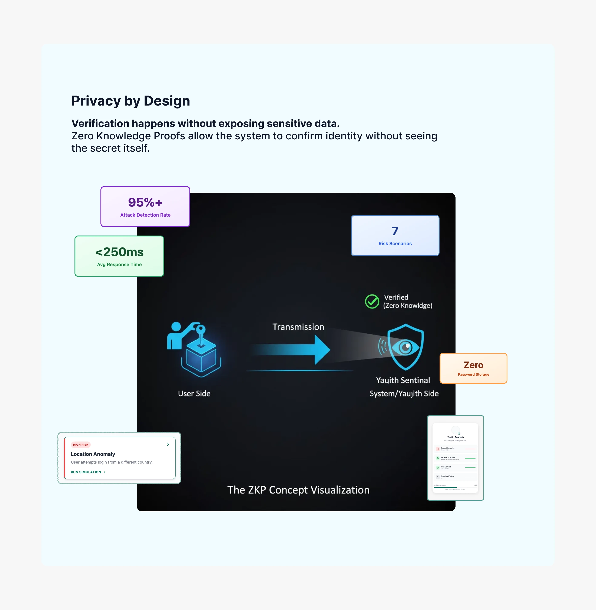

<p align="center">
  <a href="https://absher.tuwaiq.edu.sa/"></a>
  <a href="https://www.vision2030.gov.sa/"></a>
  <a href="https://react.dev/"></a>
  <a href="https://www.typescriptlang.org/"></a>
  <a href="https://vite.dev/"></a>
  <a href="https://supabase.com/"></a>
</p>

<h1 align="center">YAQITH Sentinel</h1>

<p align="center"><strong>AI-Powered Adaptive Authentication Command Center</strong></p>

---

> An AI-powered adaptive authentication **command center** for Saudi Arabia's national
> identity platform, **Absher**. YAQITH shifts login security from *"what you know"*
> (passwords, OTPs) to *"who you are"* (behavior) — so that even a stolen credential
> doesn't get an impostor through. Built by **Team SANAM** for the
> [Absher Tuwaiq Hackathon 2025](https://absher.tuwaiq.edu.sa/), and paired with a
> behavioral-AI analysis notebook over ~500 synthetic login events.

<p align="center">
  
</p>

## Overview

---

> Traditional authentication trusts a credential the moment it matches. But passwords are
> phished, OTPs are SIM-swapped, and a correct login from the wrong person looks identical
> to a correct login from the right one. YAQITH treats **every** session as untrusted until
> behavior proves otherwise — a zero-trust posture for e-government scale.

The system reads real-time signals — device identity, IP and location, typing cadence,
navigation timing, login history — scores the risk of each attempt, and adapts its response:
**allow**, **step-up challenge**, or **block**. This repository is the **admin command
center**: a single-page React dashboard where a security operator monitors that decision
flow live.

| Layer | What it answers |
|-------|-----------------|
| Signals | Who is this device, from where, behaving how? |
| Risk scoring | How likely is this the genuine user, right now? |
| Adaptive response | Allow silently, challenge, or block — and why? |

## Features

---

### Command Center

| Module | Description |
|--------|-------------|
| **Live Monitor** | Real-time feed of authentication attempts with risk indicators |
| **Threat Analytics** | Blocked-attempt statistics, anomalies, and trends across 24H / 7D / 30D |
| **Geo Map** | Interactive map of login attempts across Saudi cities and abroad |
| **Decision Engine** | Visual flow of how risk factors combine into an allow/challenge/block decision |
| **Risk Policies** | Configurable thresholds and response rules |

<p align="center">
  
</p>

### Decision Logic

Every attempt is scored and routed down one of three explainable paths — low risk passes
silently, medium risk triggers a step-up challenge, and high risk is blocked and flagged.

<p align="center">
  
</p>

### Interactive Labs

| Module | Description |
|--------|-------------|
| **Biometrics Lab** | Live behavioral-biometrics demo — typing cadence and mouse linearity, human vs. bot |
| **ZKP Visualizer** | Zero-Knowledge Proof flow — verify identity without exposing the secret |

<p align="center">
  
</p>

## Behavioral AI

---

> [`YAQITH_Sentinel_–_Behavioral_AI_Security_Agent.ipynb`](./YAQITH_Sentinel_%E2%80%93_Behavioral_AI_Security_Agent.ipynb)

The notebook is the analytical backbone behind the dashboard's risk scoring. Working from a
synthetic dataset of login events ([`yaqith_sentinel_synthetic_logins_All.xlsx`](./yaqith_sentinel_synthetic_logins_All.xlsx)),
it explores how genuine and anomalous logins differ across the seven scenarios the product
models — normal login, new device, suspicious time, location anomaly, rapid login,
behavioral deviation, and continuous monitoring — and frames the features that drive the
allow / challenge / block decision.

## Tech Stack

---

| Technology | Purpose |
|------------|---------|
| React 19 + TypeScript | Single-page dashboard UI |
| Vite 6 | Dev server and build tooling |
| Tailwind CSS | Styling (via CDN) |
| Recharts | Threat-analytics charts |
| Leaflet / react-leaflet | Interactive geo map |
| Supabase | Real-time database and authentication |
| Lucide React | Icon set |

## Quick Start

---

**Prerequisites:** Node.js 18+ and a [Supabase](https://supabase.com) project (free tier is fine).

```bash
# Install dependencies
npm install

# Configure environment
cp .env.example .env.local      # then fill in your Supabase URL + anon key

# Run the dashboard
npm run dev                     # → http://localhost:3010
```

**Seed demo data** — populate Supabase with ~500 synthetic authentication records:

```bash
npm run seed         # insert seed records
npm run seed:verify  # validate what was inserted
npm run seed:stats   # print the scenario distribution
```

## Team

---

Built by **Team SANAM** for the **Absher Tuwaiq Hackathon 2025**, organized by the Ministry
of Interior and Tuwaiq Academy in support of **Saudi Vision 2030**.

- Eman Alamari
- Majd Alqarni
- Arwa Alkibari
- Alwalah Awaji

## License

---

Released under the [MIT License](./LICENSE).
